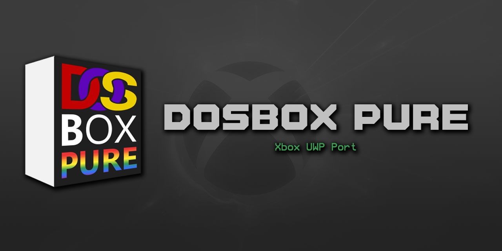

<p align="center">
  
</p>

<p align="center">
  <strong>🎮 DOS games on Windows and Xbox — no RetroArch, no fuss.</strong>
</p>

<p align="center">
  
  
  
  
</p>

---

## 🕹️ What is DOSBox Pure Unleashed UWP?

A standalone UWP port of [DOSBox Pure](https://github.com/schellingb/dosbox-pure) — the best DOS emulator for retro gaming. Runs natively on **Windows 11** and **Xbox Series (Dev Mode)** without needing RetroArch or any other frontend.

The emulation core is identical to the one used in RetroArch. What's different is everything around it: a custom menu system, an in-app file browser, native audio, and gamepad/keyboard/mouse input — all built specifically for the UWP platform.

> **🎯 Current Focus:** The project's main priority right now is compatibility and performance — making sure DOSBox Pure runs as fast and as well as possible on Windows and Xbox. New features will come after the core experience is solid and optimized.

---

## 🚀 Quick Start

### 1. 📥 Install

**Windows:**
Download the latest release from [Releases](https://github.com/marcelofrau/dosbox-pure-unleashed-uwp/releases). Sideload the `.msix` (sideloading must be enabled in Windows Settings → Developer Mode).

**Xbox:**
Enable Dev Mode on your Xbox. Download the `.msix` from [Releases](https://github.com/marcelofrau/dosbox-pure-unleashed-uwp/releases) and deploy via one of these methods:
- **Xbox Device Portal** — open `https://<your-xbox-ip>:11443` in a browser and upload the package
- **[XB Homebrew Vault](https://github.com/marcelofrau/xb-homebrew-vault)** — GUI tool for deploying homebrew to Xbox Dev Mode

### 2. 🎮 Add Games

The app includes a built-in file browser. Press **A** on "Load Game" to browse your storage. Supported formats:

| Format | Description | Example |
|--------|-------------|---------|
| `.zip` | ZIP archive containing game files | `DOOM.ZIP` |
| `.dosz` | DOSBox Pure compressed archive | `QUAKE.DOSZ` |
| `.exe` | DOS executable | `DUKE3D.EXE` |
| `.com` | DOS COM file | `TETRIS.COM` |
| `.bat` | DOS batch file | `INSTALL.BAT` |
| `.iso` | CD-ROM image | `WING COMMANDER.ISO` |
| `.chd` | Compressed Hunks of Data (CD) | `COMMAND&CONQUER.CHD` |
| `.cue` + `.bin` | CUE sheet + BIN image | `STUNT_ISLAND.CUE` |
| `.img` / `.ima` | Floppy disk image | `WOLF3D.IMG` |
| `.vhd` | Virtual Hard Disk | `WINDOWS31.VHD` |
| `.conf` | DOSBox configuration file | `custom.conf` |

### 3. 🕹️ Play

Connect a gamepad or use keyboard and mouse. See [Controls](#controls) below.

---

## 📦 Creating Compatible ZIP Files

The easiest way to package a DOS game is as a `.zip` file. DOSBox Pure mounts the ZIP as a virtual C: drive.

### Basic ZIP (single-directory game)

Many DOS games have all files in one folder. Just ZIP the whole folder:

```
DOOM/
├── DOOM.EXE
├── DOOM.WAD
├── SETUP.EXE
└── README.TXT
```

**Windows:** Right-click the folder → Send to → Compressed (zipped) folder → rename to `DOOM.ZIP`

**Command line:**
```bash
# From inside the DOOM folder:
cd DOOM
powershell -Command "Compress-Archive -Path * -DestinationPath ../DOOM.ZIP"
```

### ZIP with subdirectories

Games with subdirectories work too. DOSBox Pure preserves the folder structure:

```
DUKE3D.ZIP
├── DUKE3D/
│   ├── DUKE3D.EXE
│   ├── DUKE3D.GRP
│   └── SETUP.EXE
└── README.TXT
```

When you load `DUKE3D.ZIP`, the app shows `DUKE3D.EXE` at the root. Select it and the game runs.

### Multiple disks in one ZIP

Games that span multiple floppy disks (like many Sierra adventures) can be packaged as:

```
KQ5.ZIP
├── DISK1/
│   ├── INSTALL.BAT
│   └── ...
├── DISK2/
│   └── ...
└── DISK3/
    └── ...
```

DOSBox Pure's built-in menu (PUREMENU) lets you swap disks during gameplay.

### 💡 Best practices

- **Use UPPERCASE** for filenames and extensions — most DOS games expect this
- **Include the launcher** — if the game has `INSTALL.BAT` or `SETUP.EXE`, include it
- **Don't ZIP the ZIP** — avoid nesting ZIPs inside ZIPs
- **Max 4GB** total ZIP size recommended for Xbox (storage limits)
- **`.dosz` format** — if you want smaller files, use the [dosz tool](https://github.com/schellingb/dosbox-pure#dosz-format) for better compression

---

## 🎮 Controls

### Gamepad

| Button | Action |
|--------|--------|
| **D-Pad** | Navigate menus / arrow keys in-game |
| **A** | Confirm / primary action |
| **B** | Back / cancel |
| **X** | Varies by game |
| **Y** | Varies by game |
| **LB / RB** | Page up/down in menus / disk swap |
| **LT / RT** | Triggers (mapped per game) |
| **Left Stick** | Mouse emulation |
| **Right Stick** | Scroll / secondary input |
| **Start** | PUREMENU (in-game settings) |
| **Back** | Close menu / exit |

### ⌨️ Keyboard

Standard DOS keyboard mapping. All keys work as expected: arrows, Enter, Escape, F1-F12, Ctrl, Shift, Alt, Tab, etc.

### 🖱️ Mouse

On **Windows**, USB mice work directly. On **Xbox**, mouse input is emulated through the left analog stick — USB mice are not supported due to UWP platform limitations. Works in all DOS games that use mouse input (Doom, Duke Nukem 3D, etc.).

### ⌨️ Keyboard Shortcuts

| Key | Action |
|-----|--------|
| **F10** | Toggle menu |
| **Ctrl+L** | Open system file picker (fallback) |

---

## ✨ Features

| Feature | Status |
|---------|--------|
| 🖥️ DOS emulation (CPU, memory, sound) | ✅ Done |
| ⚡ Dynamic recompiler (JIT, 5-10x speedup) | ✅ Done |
| 🖼️ D2D/D3D11 video pipeline with letterbox | ✅ Done |
| 🔊 XAudio2 audio output (low latency) | ✅ Done |
| 📂 In-app file browser (gamepad + mouse) | ✅ Done |
| 📋 FrontendMenu (DOS-style BIOS menu) | ✅ Done |
| 🎮 Gamepad input (Xbox controller) | ✅ Done |
| ⌨️ Keyboard input (full DOS mapping) | ✅ Done |
| 🖱️ Mouse input (stick emulation on Xbox, USB on PC) | ✅ Done |
| 🍔 PUREMENU (in-game OSD settings) | ✅ Done |
| 💾 ZIP/ISO/CHD/IMG mounting | ✅ Done |
| 📦 Self-signed MSIX packaging | ✅ Done |
| 💾 Save states | ⏳ Planned |
| 💿 Multi-disc eject/swap (disk control) | ⏳ Planned |
| 🎨 Shader support | ⏳ Planned |
| 📺 CRT display filters | ⏳ Planned |
| 🔍 Video scale modes (pixel-perfect, integer) | ⏳ Planned |
| 🌐 Network play (IPX tunneling) | ⏳ Planned |

---

## 🙏 Credits

This project stands on the shoulders of amazing open-source work.

### DOSBox Pure

[DOSBox Pure](https://github.com/schellingb/dosbox-pure) by [schellingb](https://github.com/schellingb) — a libretro core for DOS emulation. The entire emulation engine (CPU, memory, sound, disk mounting, input) comes from this project. It is the heart of DOSBox Pure Unleashed UWP.

### DOSBox

[DOSBox](https://www.dosbox.com/) — the original DOS emulator that has kept classic games alive for over two decades. DOSBox Pure is built on top of the DOSBox codebase.

### DOSBox Pure Unleashed

[DOSBox Pure Unleashed](https://github.com/marcelofrau/dosbox-pure-unleashed) — the original desktop frontend built with ZillaLib. Served as the reference for core integration patterns, build configuration, and the foundation that led to this UWP port.

### libretro

[libretro](https://www.libretro.com/) — the cross-platform API that makes emulator cores portable across frontends. DOSBox Pure is a libretro core, and this project implements a standalone libretro frontend for UWP.

### RetroArch

[RetroArch](https://www.retroarch.com/) — the reference libretro frontend. The UWP VFS implementation and several architectural patterns in this project are adapted from [RetroArch's UWP port](https://github.com/XboxEmulationHub/RetroArch).

---

## ❤️ Special Thanks

### Emulation Revival Community

Huge thanks to the [Emulation Revival](https://www.youtube.com/@EmulationRevival) community for the amazing support, testing, and feedback:

- 🎉 **MewLew** 
- 🧪 **DanP142** 
- 💪 **Caorthann** 
- 🚀 **alouisious** 

Your energy and passion for retro gaming make projects like this worthwhile.

---

## 🛠️ For Developers

This section covers build instructions and technical architecture for contributors.

### 🔨 Building from Source

#### Prerequisites

- **Visual Studio 2022** (v17.x, not v18 preview)
- **Windows SDK 10.0.26100.0**
- **x64 only** — ARM/ARM64/x86 not supported (Xbox Series is x64)

#### Build

```powershell
MSBuild.exe "dosbox-pure-unleashed-uwp.sln" /p:Configuration=Release /p:Platform=x64 /nowarn:MSB4011
```

Or use the build script:

```powershell
.\scripts\build.ps1 -Configuration Release -Platform x64
```

#### 📦 Package (MSIX)

```powershell
.\scripts\package.ps1 -Configuration Release -Platform x64
```

Auto-creates a self-signed certificate if none exists.

#### ▶️ Run (Windows)

```powershell
.\scripts\run.ps1 -Configuration Release -Platform x64
```

Builds, registers, and launches the app.

#### 📱 Deploy (Xbox)

For deploying to Xbox, use one of these methods:

- **Xbox Device Portal** — open `https://<your-xbox-ip>:11443` in a browser, navigate to Apps, and upload the `.msix` package
- **[XB Homebrew Vault](https://github.com/marcelofrau/xb-homebrew-vault)** — GUI tool for deploying homebrew to Xbox Dev Mode

### 🔍 How It Works

The app is a **libretro frontend**. The dosbox-pure core (in `extern/dosbox-pure/`) handles all emulation. Our code provides:

1. **🎬 Video** — Core calls `retro_video_refresh_cb()` with an XRGB8888 framebuffer. We copy it to a D2D bitmap or D3D11 texture and render with letterboxing.

2. **🔊 Audio** — Core calls `retro_audio_sample_batch()` with stereo PCM16. We submit to XAudio2 with a 32-slot buffer pool and queue-depth cap (~20ms max latency).

3. **🎮 Input** — `retro_input_poll()` reads gamepad/keyboard/mouse state. `retro_input_state()` returns button states.

4. **⚙️ Environment** — `retro_environment()` handles VFS, configuration, hardware render rejection (SW path forced), and keyboard callbacks.

### 📁 Project Structure

```
dosbox-pure-unleashed-uwp/
├── dosbox-uwp/                       UWP frontend (our code)
│   ├── App.cpp/h                     Entry point, Ctrl+L fallback
│   ├── dosbox_uwpMain.cpp/h          Main loop, input routing, audio pacing
│   ├── Content/
│   │   ├── RetroCore.cpp/h           libretro bridge: init/load/run/callbacks/VFS
│   │   ├── RetroScreenRenderer.cpp/h D2D bitmap + letterbox rendering
│   │   ├── XAudio2Output.cpp/h       XAudio2 audio: ring buffer, queue cap
│   │   ├── FrontendMenu.cpp/h        DOS-style BIOS menu overlay
│   │   ├── FileBrowser.cpp/h         In-app file explorer (D2D)
│   │   └── SdlInput.cpp/h            SDL gamepad + UWP fallback
│   ├── local/dosbox-pure/            Patched core files (UWP compat)
│   └── Package.appxmanifest          UWP manifest + capabilities
├── extern/
│   ├── dosbox-pure/                  Submodule: emulation core (unmodified)
│   ├── libretro-common/              VFS + UWP helpers (selective copy)
│   └── uwp-xray-depot/              TCP diagnostics + Lua REPL (Debug)
├── scripts/                          Build, package, deploy scripts
├── docs/                             Documentation
│   ├── ARCHITECTURE.md               Technical deep-dive
│   ├── ROADMAP.md                    Development phases
│   ├── DYNAREC_UWP.md               JIT compiler on UWP
│   └── discoveries.md               Bug investigations & fixes
└── dosbox-pure-unleashed-uwp.sln     Solution file
```

### 📚 Documentation

| Document | Description |
|----------|-------------|
| [Architecture](docs/ARCHITECTURE.md) | Technical deep-dive: dependency graph, rendering pipeline, libretro interfaces |
| [Roadmap](docs/ROADMAP.md) | Development phases with detailed status |
| [Dynarec on UWP](docs/DYNAREC_UWP.md) | JIT compiler setup and performance |
| [Discoveries](docs/discoveries.md) | Bug investigations, audio pacing analysis, technical debt |

### 🔬 xb-xray (Developer Diagnostics)

Debug builds include [xb-xray](https://github.com/marcelofrau/uwp-xray-depot) — a TCP diagnostics tool for Xbox Dev Mode. When enabled, the app opens a TCP socket on port 9000-9009.

```bash
# Quick connect with netcat:
nc <xbox-ip> 9000
```

Features: live logs, variable inspection (`fps`, `audio_queued`, `frame_ms`), and a Lua REPL for runtime tweaking. Zero overhead in Release builds.

---

## 📄 License

This project is based on [DOSBox Pure](https://github.com/schellingb/dosbox-pure) by [@schellingb](https://github.com/schellingb).

**Licensed under the GNU General Public License v2.0 (GPL-2.0)** — same as DOSBox Pure.

This license applies to all source code in this repository, including the UWP frontend, patched core files, and build scripts. See [extern/dosbox-pure/LICENSE](extern/dosbox-pure/LICENSE) for the full license text.

Third-party components retain their original licenses:
- xb-xray, spdlog, Lua 5.4: MIT
- libretro-common: MIT
- RetroArch UWP (reference only, not linked): GPL-3.0
